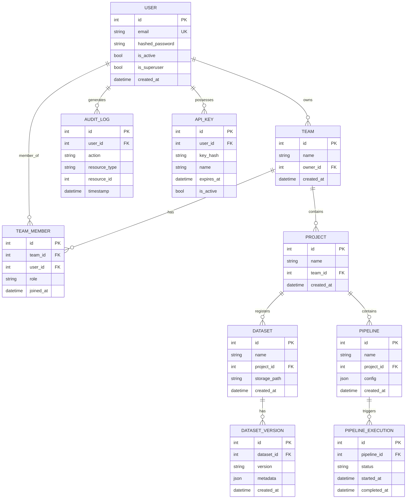

# Database Schema (ERD)

This document provides a visual overview of the Xether AI Backend database structure.

```mermaid
erDiagram
    USER ||--o{ TEAM : owns
    USER ||--o{ TEAM_MEMBER : member_of
    TEAM ||--o{ TEAM_MEMBER : has
    TEAM ||--o{ PROJECT : contains
    PROJECT ||--o{ DATASET : registers
    PROJECT ||--o{ PIPELINE : contains
    DATASET ||--o{ DATASET_VERSION : has
    PIPELINE ||--o{ PIPELINE_EXECUTION : triggers
    USER ||--o{ AUDIT_LOG : generates
    USER ||--o{ API_KEY : possesses

    USER {
        int id PK
        string email UK
        string hashed_password
        bool is_active
        bool is_superuser
        datetime created_at
    }

    TEAM {
        int id PK
        string name
        int owner_id FK
        datetime created_at
    }

    TEAM_MEMBER {
        int id PK
        int team_id FK
        int user_id FK
        string role
        datetime joined_at
    }

    PROJECT {
        int id PK
        string name
        int team_id FK
        datetime created_at
    }

    DATASET {
        int id PK
        string name
        int project_id FK
        string storage_path
        datetime created_at
    }

    DATASET_VERSION {
        int id PK
        int dataset_id FK
        string version
        json metadata
        datetime created_at
    }

    PIPELINE {
        int id PK
        string name
        int project_id FK
        json config
        datetime created_at
    }

    PIPELINE_EXECUTION {
        int id PK
        int pipeline_id FK
        string status
        datetime started_at
        datetime completed_at
    }

    AUDIT_LOG {
        int id PK
        int user_id FK
        string action
        string resource_type
        int resource_id
        datetime timestamp
    }

    API_KEY {
        int id PK
        int user_id FK
        string key_hash
        string name
        datetime expires_at
        bool is_active
    }
```
